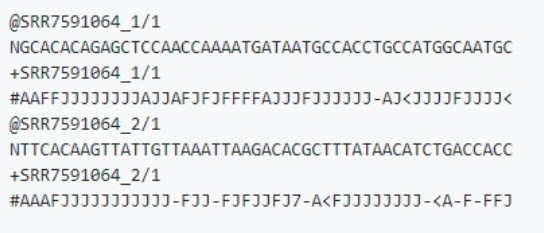
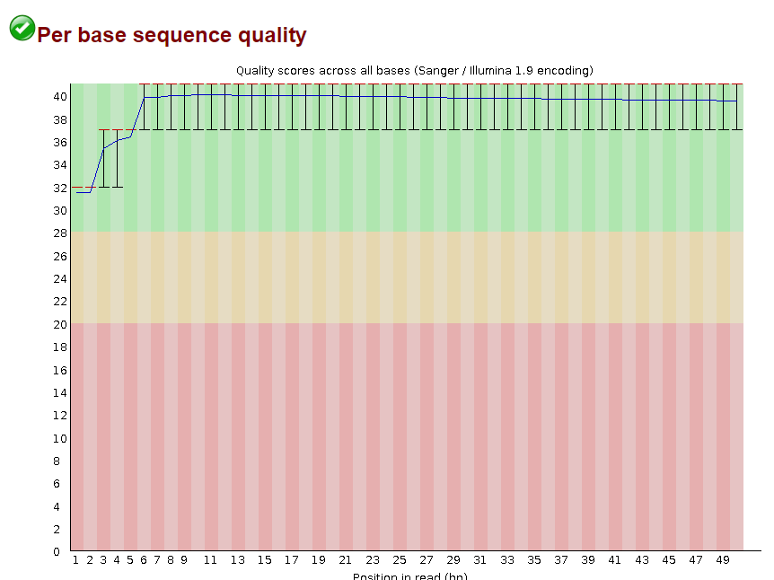
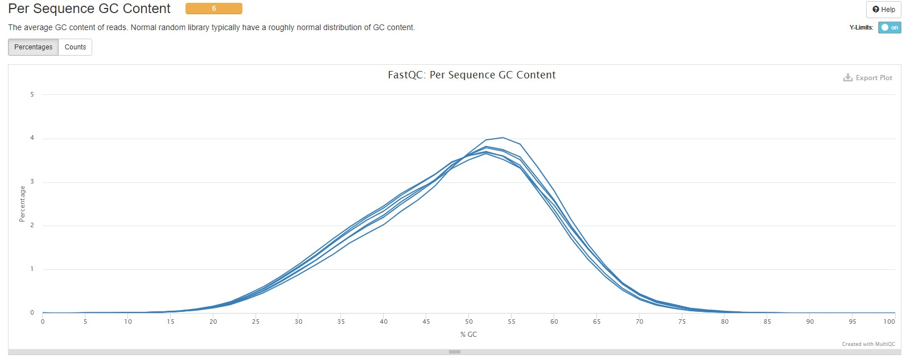
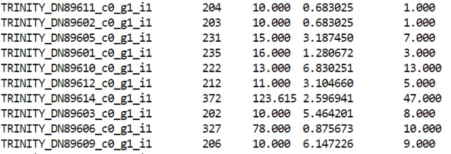
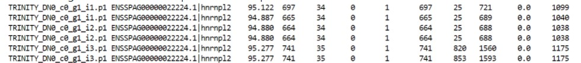

# TP NGS Clowwnfish

_**Redmed of Miguel Camacho**_

_Actinoterygian_ fishes present different patterns of pigmentation. These patterns of adult pigmentation are important for ecology, development and genetics. 

_Actinoterygian_ fishes present 8 cell types of pigmentation compared  to mammals, that have only one. Two of these pigmentation cells are iridophore that refers to a reflective tissue and leucophore for white tissue.

Here, authors asked whether the white bars of the coral reef fish _**Amphiprion ocellaris**_, known as the clown fish, are composed of iridophores or with leucophores or maybe both. To answer this question, we used the transcriptomic analysis  through this TP NGS. 
 
 

## Project      
Analysis of the _A. ocellaris_ fish skin transcriptome to find gene candidates involved in the presence of iridophores in white skin.

The Reference paper: Salis, P, Lorin, T, Lewis, V, et al. Developmental and comparative transcriptomic identification of iridophore contribution to white barring in clownfish. _Pigment Cell Melanoma Res._ 2019; 32: 391– 402. https://doi.org/10.1111/pcmr.12766

## Data-set 
Samples were taken from 3 individuals: each one with orange and white tissue (in total 6 samples).
The RNA-Senquencing method was carried out with the Illumina technology Signle-End (50 reads)

## Objective
 To determine the presence of the gen saiyan, a candidate gene involved in the presence of iridophores in white strips. 

---
## Analyses steps
### I. Download the reads for the study
  
  * **Downloading the RNA-seq files**. The script _`RNAseq_data.sh`_ describes the procedure used to get the fastaq files (by using their SSR accessions) from the NCBI database. We created the directory sra_data to store these fastaq files. 
  
 

  * **Control of quality of the fastaq files**. We applied the FASTQC function to the reads. Script _`Control_quality.sh`_  describes the steps we did. We create an HTML file for each read with the quality of sequences. We obtained different statistics to measure and check the quality of fastaq files. One of the most important was **Per base sequence quality**. 
 
 
 
   * **Multiple control of quality of the fastaq files**.  Using the MULTIQC function, we evaluated to quality of the assemble of all reads. See the script _`MultiQC.sh`_. After the running of MULTIQC function, we saw that the quality was acceptable so we did not need to clean the data. 

		
 
 ### II. Data assembly
 **Assembly of the reads**.  To assembly the sequences, we used the trinity function, which is detailed in this web site: https://github.com/trinityrnaseq/trinityrnaseq/wiki/Running-Trinity. Trinity used three modules (Ichworm, Chrysalis and Butterfly) to assemble the fastaq files into linear sequences. The script _`Trinity.sh`_ decribes how reads were assembled into a Fasta file.  Trinity also **groups** isoforms and separate paralogs.
 	Because the Trinity function could take long time, we used the `nohup` command to run the script. 
 
 
 ### III. Quantifying the expression of the transcripts 
After data assembly, we focused to quantify the transcript expression. For this, we used the tool Salmon, which analyzed whether a transcript was more express in our output of Trinity. By following indications from this web site: https://salmon.readthedocs.io/en/latest/salmon.html](https://salmon.readthedocs.io/en/latest/salmon.html), we created the script _`Salmon.sh`_. More the gene presented reads, the more this gene was expressed. 

 
 The first column showed the name of the transcript. The second column, its length. The fourth column indicates the transcripts per million (TPM), which means the total number of reads normalized by the overall length.
 
 ### IV. Data annotation
 
 * **Comparation our data with a genome of reference** We downloaded the genome of _Stegastes partitus_ which presents a similar genome compared to the clownfish in the script _`escribir_el_nombre`._  The script _`Rename_transcript`_  renamed the _S. partitus_ sequences by using the command `awk`. The command `gunzip` was apply to unzid the downloaded genome. 

* **Analyses of the proteomic data of our transcripts** We use the transcoder tool to found the conserved coding regions. Again, following the steps from this web site:  https://github.com/TransDecoder/TransDecoder/wiki, we made the script `transcoder.sh`. 
   Before the blast, we rename the Transdecoder's output with the following code: 
	`awk '{print $1}' Trinity.fasta.transdecoder cds > rename.cds`
	
* **Evaluation of homologies between transcripts of _A. ocellaris_ and their references _S. partitus_. 

   See the script _`blast.sh`_. 
   
   
   The blast tool helps us to compare our data (clown fish) with the reference data. The first column refers to the name of trinity transcripts and second ones to the references transcripts. The important data is carry by the column 9th show the blast e-value which means to the number of expected hits of similar quality (score). A smaller e-value indicates a better match whereas the bit score showed in the last column indicates the bit-score. The higher the bit-score, the better the sequence similarity. 
  
   
   The command `cut -f1 blast |sort |uniq |wc -l` allows to see how many hit the blast found.
 
 ###  V. Statistical analysis. 
 
Because we had a few samples transcripts, we could not analyzed by using the classical statistics. So we use the tool DeSeq2, from the R package, to measure the the differential expression between the orange and the white tissue with multiple tests. In the script `DeSeq2.R`, we used the transcript information from salmon to analyze them. In fact, DeSeq2 corrects the the p-value in a padj by taking an an approximate value of false positive. 

The "white" condition was used as a reference for further analysis. 
Here is the table showing the genes deferentially expressed between the white and orange tissues. 

 

